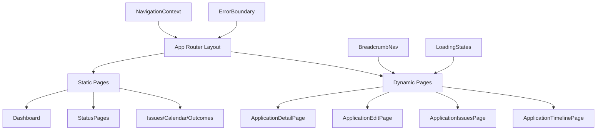

# SPA Routing Refactor - Architectural Plan

## Overview

This document outlines the complete refactoring plan to transform the existing modal-based application architecture into a dynamic single-page application (SPA) routing system using Next.js App Router with hybrid hosting.

## Current Architecture Analysis

### Modal Usage Patterns Identified
1. **ApplicationDetailPanel** - Primary modal component (1,037 lines)
2. **Modal wrapper** - Generic modal container (77 lines)
3. **Modal triggers** in:
   - Dashboard page (upcoming determinations)
   - StatusPage components (table row clicks)
   - CalendarView (event links)
   - IssuesPage (application navigation)

### Current Routing Structure
```
/ (dashboard)
/submitted (status page)
/invalidated (status page)
/live (status page)
/determined (status page)
/issues (issues page)
/calendar (calendar page)
/outcomes (outcomes page)
```

## New Architecture Design

### Enhanced URL Structure
```
/ (dashboard - static)
/submitted (status page - static)
/invalidated (status page - static)
/live (status page - static)
/determined (status page - static)
/issues (issues page - static)
/calendar (calendar page - static)
/outcomes (outcomes page - static)
/applications (applications board - dynamic host)
/applications/new (new application form - dynamic host)
/applications/[id] (dynamic application detail page)
/applications/[id]/edit (dynamic edit mode)
/applications/[id]/issues (dynamic application issues view)
/applications/[id]/timeline (dynamic timeline view)
```

### Hybrid Hosting Strategy

**AWS Amplify (Static Pages)**
- Dashboard and all status pages
- Issues, calendar, outcomes pages
- Maintains current deployment pipeline
- Leverages existing AWS infrastructure

**Vercel (Dynamic Pages)**
- All `/applications/[id]` routes
- Server-side rendering for SEO
- Dynamic data fetching
- Free tier sufficient for current usage

### Component Architecture



## Implementation Strategy

### Phase 1: Foundation Setup
1. **Next.js Configuration Updates**
   - Modify `next.config.js` for hybrid routing
   - Configure static export for Amplify pages
   - Set up dynamic routing for Vercel pages

2. **State Management Setup**
   - Implement React Context for navigation state
   - Create route persistence utilities
   - Add loading state management

3. **Component Infrastructure**
   - Create base page layout components
   - Implement breadcrumb navigation
   - Add loading and error components

### Phase 2: Dynamic Route Implementation
1. **Application Detail Pages**
   - Create `/applications/[id]/page.tsx`
   - Convert ApplicationDetailPanel to full-page component
   - Add SEO meta tags and Open Graph data
   - Implement responsive design

2. **Additional Application Routes**
   - `/applications/[id]/edit` - Edit mode
   - `/applications/[id]/issues` - Issues view
   - `/applications/[id]/timeline` - Timeline view

3. **URL Parameter Handling**
   - Application ID validation
   - Query parameter support for filters/views
   - Deep linking capabilities

### Phase 3: Navigation Updates
1. **Update Existing Components**
   - StatusPage: Replace modal triggers with Link components
   - CalendarView: Update applicationRoute usage
   - IssuesPage: Replace router.push with Link navigation
   - Dashboard: Update upcoming determinations links

2. **Navigation Guards**
   - Protected route middleware
   - Authentication checks
   - Error handling for invalid application IDs

### Phase 4: Modal Removal
1. **Remove Modal Dependencies**
   - Delete Modal component
   - Remove modal-related CSS
   - Clean up modal state management

2. **Update Component Imports**
   - Remove Modal imports from all components
   - Update component prop interfaces
   - Clean up unused modal-related code

### Phase 5: Advanced Features
1. **Performance Optimization**
   - Implement lazy loading for application pages
   - Add route-based code splitting
   - Optimize bundle sizes

2. **User Experience Enhancements**
   - Add page transitions
   - Implement loading skeletons
   - Add route-based analytics

3. **SEO and Accessibility**
   - Dynamic meta tags for each application
   - Structured data markup
   - Accessibility improvements

## Technical Specifications

### Next.js Configuration
```javascript
// next.config.js
const nextConfig = {
  reactStrictMode: true,
  output: 'export', // For static pages
  trailingSlash: true,
  images: {
    unoptimized: true,
  },
  experimental: {
    typedRoutes: true,
  },
  // Conditional configuration for dynamic routes
  ...(process.env.VERCEL ? {
    output: undefined, // Enable SSR for Vercel
  } : {}),
};
```

### State Management Structure
```typescript
interface NavigationState {
  currentApplication: ApplicationDto | null;
  breadcrumbs: BreadcrumbItem[];
  isLoading: boolean;
  error: string | null;
}

interface BreadcrumbItem {
  label: string;
  href: string;
  isActive: boolean;
}
```

### Route Structure
```typescript
// Route definitions
const routes = {
  dashboard: '/',
  applications: {
    list: '/applications',
    detail: (id: string) => `/applications/${id}`,
    edit: (id: string) => `/applications/${id}/edit`,
    issues: (id: string) => `/applications/${id}/issues`,
    timeline: (id: string) => `/applications/${id}/timeline`,
  },
  status: {
    submitted: '/submitted',
    invalidated: '/invalidated',
    live: '/live',
    determined: '/determined',
  },
  issues: '/issues',
  calendar: '/calendar',
  outcomes: '/outcomes',
} as const;
```

## Deployment Strategy

### Development Workflow
1. **Local Development**
   - All routes work with `npm run dev`
   - Dynamic routes served by Next.js dev server
   - Static routes pre-rendered

2. **Build Process**
   - Static pages: `npm run build` with export
   - Dynamic pages: Standard Next.js build for Vercel

3. **Deployment Pipeline**
   - Amplify: Deploy static pages from `/out` directory
   - Vercel: Deploy dynamic pages with automatic builds

### Environment Configuration
```bash
# Amplify Environment Variables
NEXT_PUBLIC_API_BASE_URL=https://api.example.com
NEXT_PUBLIC_STATIC_ONLY=true

# Vercel Environment Variables  
NEXT_PUBLIC_API_BASE_URL=https://api.example.com
NEXT_PUBLIC_STATIC_ONLY=false
```

## Migration Timeline

### Week 1: Foundation
- [ ] Update Next.js configuration
- [ ] Create base components and layouts
- [ ] Implement state management

### Week 2: Dynamic Routes
- [ ] Create application detail pages
- [ ] Implement URL parameter handling
- [ ] Add SEO meta tags

### Week 3: Navigation Updates
- [ ] Update all existing components
- [ ] Implement navigation guards
- [ ] Add breadcrumb navigation

### Week 4: Modal Removal & Testing
- [ ] Remove modal components
- [ ] Comprehensive testing
- [ ] Performance optimization

### Week 5: Deployment
- [ ] Set up Vercel deployment
- [ ] Configure hybrid hosting
- [ ] Production testing and monitoring

## Success Metrics

### Performance
- [ ] Page load times < 2 seconds
- [ ] First Contentful Paint < 1.5 seconds
- [ ] Lighthouse score > 90

### User Experience
- [ ] All navigation flows working
- [ ] Browser back/forward buttons functional
- [ ] Deep linking working correctly
- [ ] Mobile responsive design

### SEO
- [ ] Dynamic meta tags for all application pages
- [ ] Open Graph data for social sharing
- [ ] Structured data markup

### Technical
- [ ] Zero modal-related code remaining
- [ ] All routes properly configured
- [ ] Error handling comprehensive
- [ ] Loading states implemented

## Risk Mitigation

### Deployment Risks
- **Mitigation**: Incremental deployment with feature flags
- **Rollback**: Maintain current modal system until full migration

### Performance Risks
- **Mitigation**: Implement lazy loading and code splitting
- **Monitoring**: Set up performance monitoring

### User Experience Risks
- **Mitigation**: Comprehensive testing across devices
- **Feedback**: Implement user feedback collection

## Conclusion

This refactoring plan transforms the application from a modal-based architecture to a modern SPA with proper routing, while maintaining the existing AWS infrastructure and adding Vercel for dynamic capabilities. The hybrid hosting approach provides the best of both worlds: static performance for main pages and dynamic capabilities for application details.

The incremental implementation strategy ensures minimal disruption to current users while providing a clear path to a more scalable and maintainable architecture.
